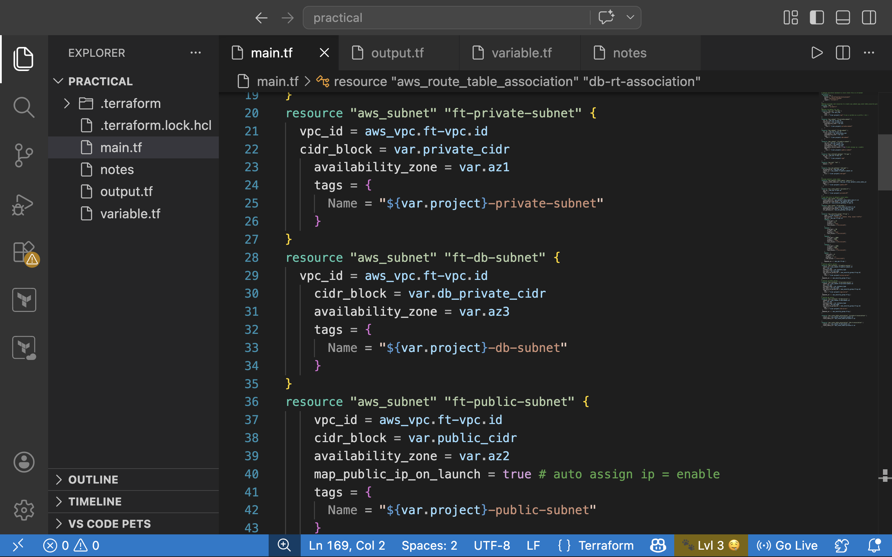
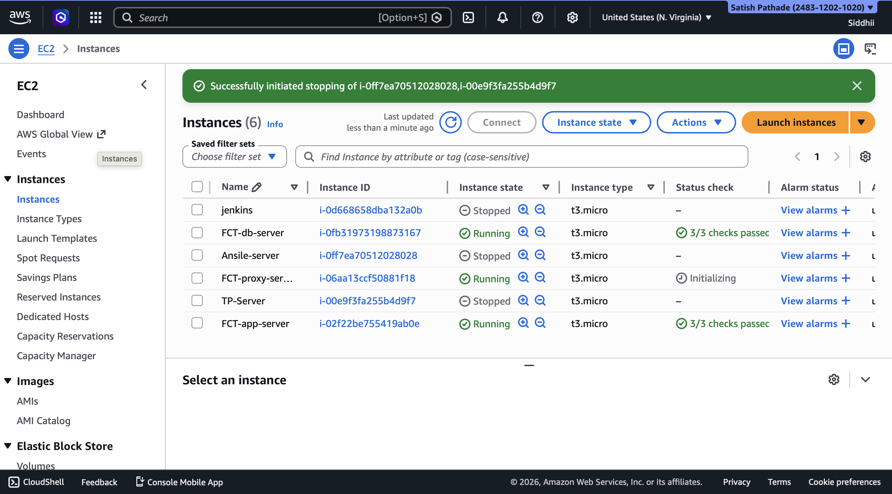
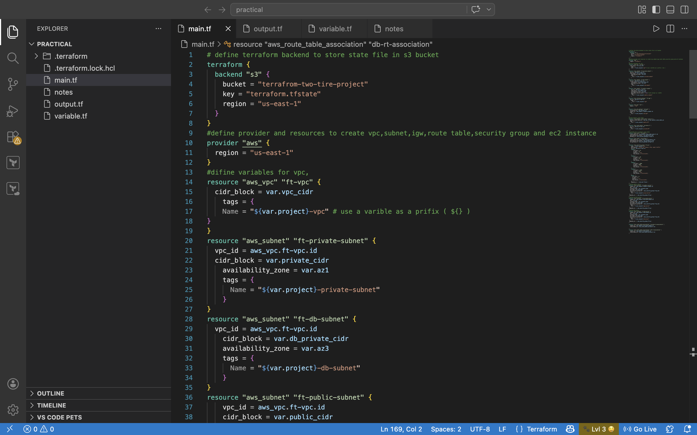
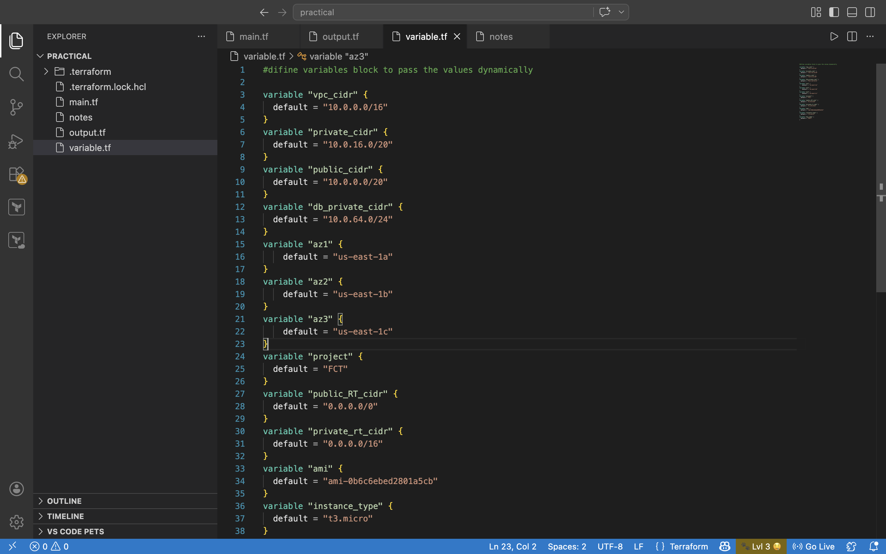

# 🚀 AWS Infrastructure using Terraform

## 📌 Overview
This project demonstrates how to create and manage AWS infrastructure using Terraform.  
It includes networking components and compute resources deployed using Infrastructure as Code (IaC).

---

## 🏗️ Architecture
The project includes:
- Custom VPC
- Public and Private Subnets
- Internet Gateway
- NAT Gateway
- Route Tables
- EC2 Instances

---

## 🛠️ Tools & Technologies
- AWS (EC2, VPC, Networking)
- Terraform
- GitHub

---

## ⚙️ Implementation Details
- Created a custom VPC for isolated network environment  
- Configured public and private subnets  
- Set up Internet Gateway for external access  
- Configured NAT Gateway for private subnet access  
- Created route tables for traffic management  
- Launched EC2 instances  
- Automated infrastructure using Terraform  

---

## 📸 Project Screenshots

### VPC Setup
  
Created a custom VPC to manage network resources.

### Subnets Configuration
  
Configured public and private subnets for better resource separation.

### EC2 Instances
  
Launched EC2 instances for hosting application components.

### Terraform Execution
  
Used Terraform commands to provision infrastructure.

### Architecture Diagram
  
Represents overall infrastructure design and connectivity.

### Variables Configuration


Defined input variables in Terraform to make the infrastructure reusable and flexible.


---

## 📚 Learning Outcomes
- Understanding of AWS networking concepts (VPC, Subnets, Routing)  
- Hands-on experience with Terraform (Infrastructure as Code)  
- Knowledge of deploying and managing cloud resources  
- Improved understanding of real-world cloud architecture  

---

## ▶️ How to Run

```bash
terraform init
terraform plan
terraform apply
